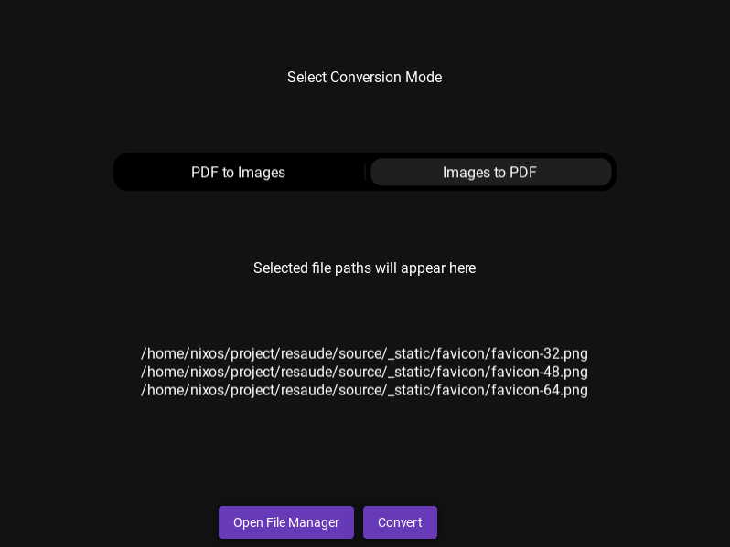
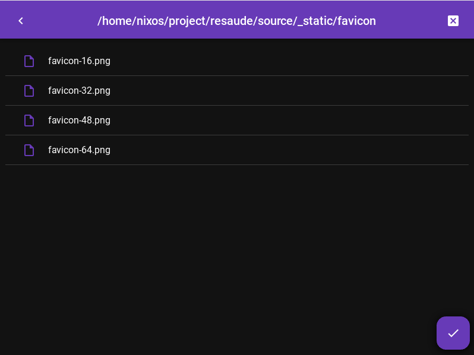

[](https://github.com/pre-commit/pre-commit)
[](https://github.com/astral-sh/ruff)
[](https://github.com/PyCQA/bandit)
[](https://mypy-lang.org/)

A GUI fot the pdf-img-converter


0

# Installation

```bash
pip install <path-to-this-project>
```
or
```bash
pip install git+<git-url>
```

to install it in editable mode:
```bash
pip install -e .
```

to add developpement dependencies:
```bash
pip install -e ".[dev]"
```

# Setup dev' environment

Use [Nix](https://zero-to-nix.com/) with [direnv](https://github.com/nix-community/nix-direnv) to automatically build your development environment,
or simply run `nix develop`.

# Use CI environment

To use `CI` environment instead of development, you can execute `nix develop .#ci`

# Build

Use [Nix](https://zero-to-nix.com/) command: `nix build`
